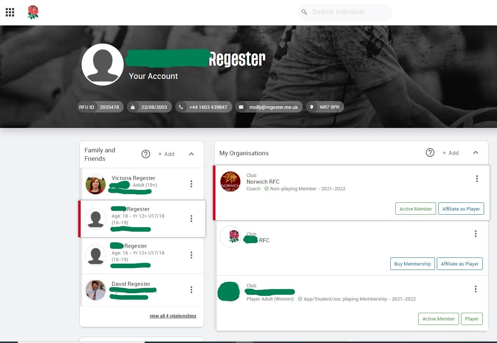
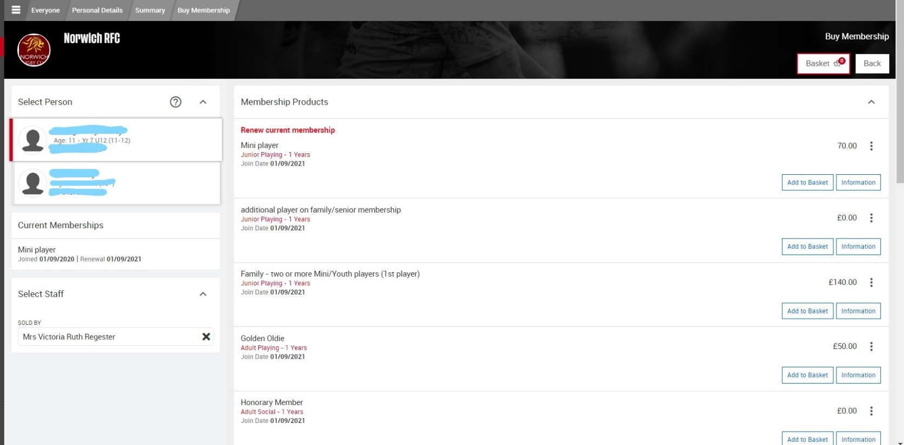
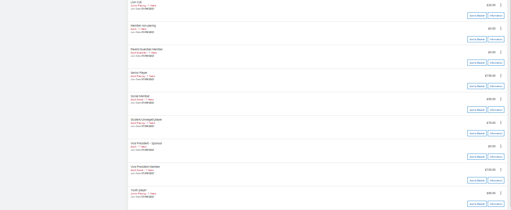

# Buying Membership on GMS
 1. Log into GMS - https://gms.rfu.com/GMS/Account/Login
 2. You will see your dashboard:

 3. Click on the name of the first player you wish to buy membership for. It should then show THEIR name at the top above “Your Account”.
 4. Click “Buy Membership” in the box for Norwich RFC.
 
This will take you to the following page:

Scroll down for more options:

5. Click on “add to basket” for the membership you wish to buy for that player (`Lion Cub, Mini or Youth player`).
6. Click on the adult’s name, click on `parent/guardian` member and add to basket (at £0)
7. Do the same if there is a second adult.
8. Click checkout, check you have the right membership category against the right name and follow the steps to buy.

## How to buy membership if you have two or more children playing

Follow steps 1-4 above.

THEN, click on your oldest child and buy “`Family - two or more Mini/Youth players (1st player)`” at £140.

You can then purchase memberships for any other playing children in your family by clicking their name and buying “`additional player on family/senior membership`” at £0.

This means that if you have 2 or more playing children the maximum you will pay is £140.