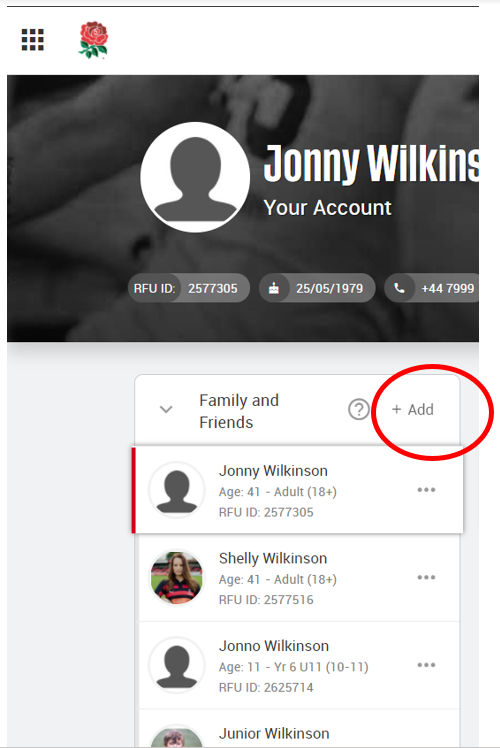
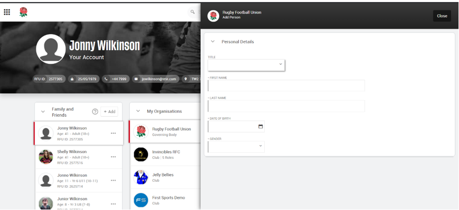
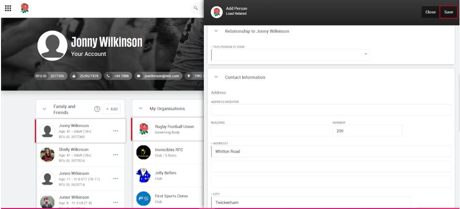
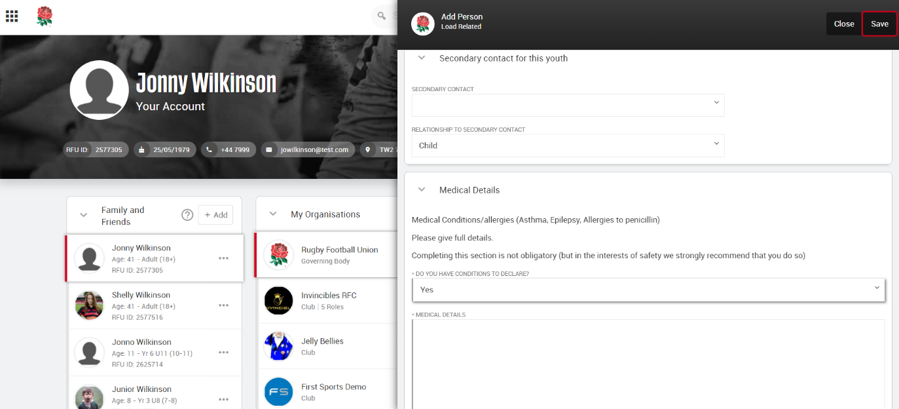
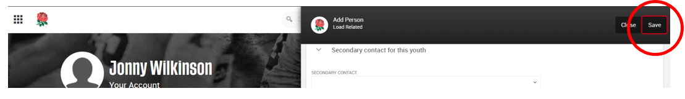

# HOW TO ADD A FAMILY MEMBER

To add family members, and link them to linked to your account, log into GMS, select 'add' on your dashboard within the **Family and Friends** widget.



This will bring up the pop screen to fill in the details of the new member, such as name and date of birth.



Once you’ve added in the basic information you will be then able to add more information such as the relationship you have with the person you are adding. This is where you will also add any medical information and secondary school information if you are adding a child.





Once all details have been added, click save at the top of the screen and this will create a new account for the individual you are adding.


