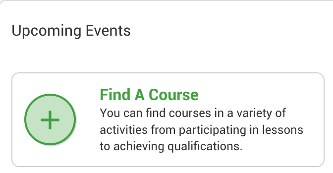
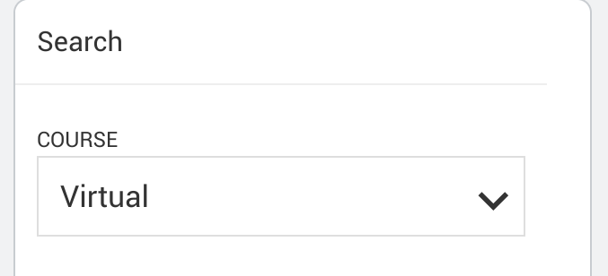
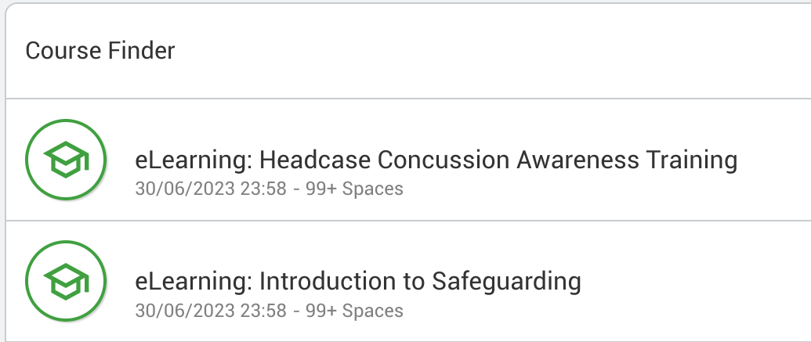
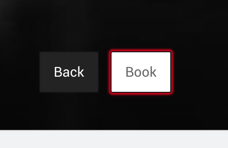

# Accessing RFU Courses

To book a course you can use the RFU course finder. If you want help out then the RFU ask that you complete the on line "Introduction to Safeguarding" course **before** you start volunteering. You can do this while your DBS is being processed.

The online courses are free and each take around 30 minutes complete. As a parent the "Headcase Concussion Awareness Training" is a useful set of skill to have. It will help you notice potential symptoms of conclusion in your child following a knock in a game.

1. Before starting these courses, first log into your GMS account. This will tag the course to your GMS record. Goto https://gms.rfu.com/GMS/Dashboard/Organisation/601

1. After logging in, at the bottom of your dashboard page there is a green plus with the text "Find a Course", click that and it will take you to the course finder.
   

1. Pull down the course selector and choose **Virtual**

1. This will list the eLarning courses

1. Click booke, and the buy the course and check.

You will then get an email from the RFU with a link to the course.
