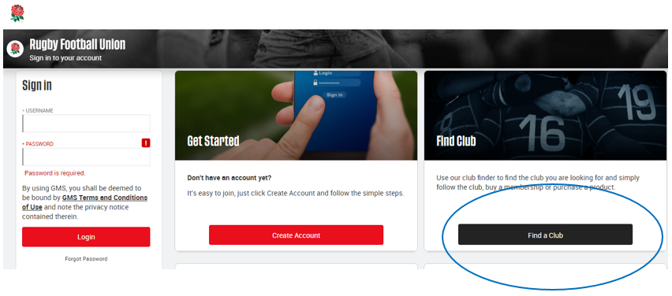
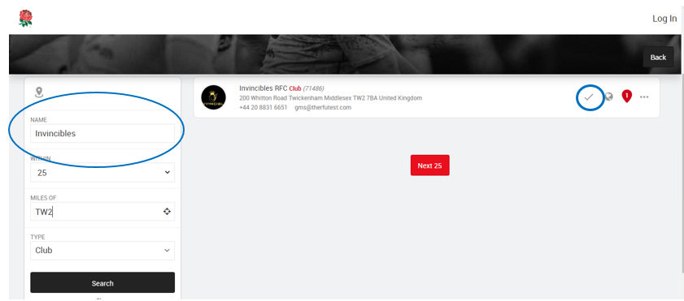
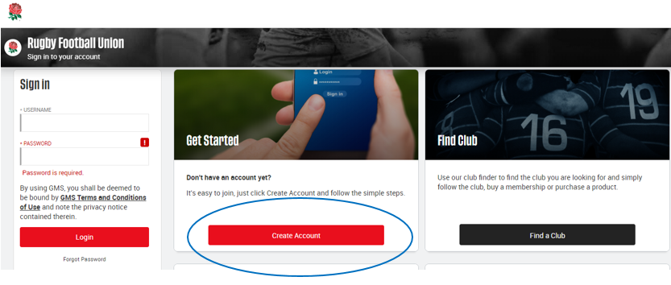
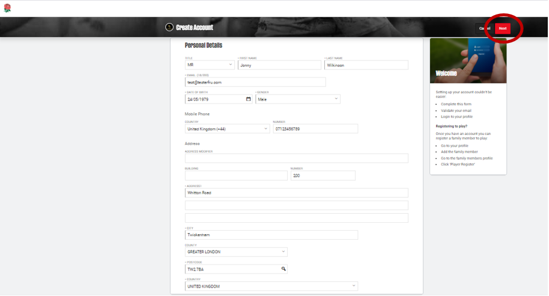
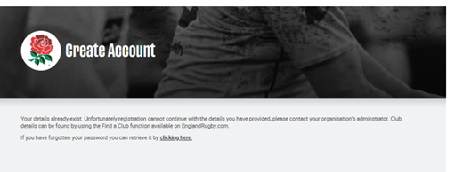
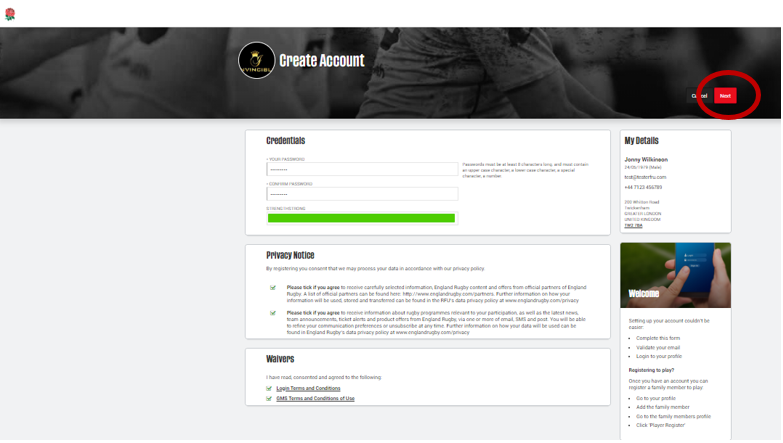

# HOW DO I CREATE AN ACCOUNT

Start by visiting https://gms.rfu.com/GMS/Account/Login. \
Please check first that you do not have an existing GMS account already set up for you, before you create a duplicate account by clicking on the ‘Forgot Password’ link on the Sign in page for GMS and follow the instructions. Enter your email addresses (or if you have more than one email account) and/or username. If you do not know this please contact your club/school/university where they can look up your profile and send you your credentials and the link for you to reset your password.

### If you don’t have a GMS account already:
From the landing page for you to be linked to a club click on Find a Club to search and locate the club by name, postcode or town you want to be linked with, click the tick as circled in blue and then click on Create Account.

Or simply click on **create an account** if you do not wish to be linked to a club.

Simply fill out the mandatory personal details on this page such as: First and Last name, email, DOB, mobile number and address, and click on **NEXT**. \
Enter the first line of the address or house number and postcode, and the address finder (click on the magnifying glass icon) will auto populate the rest of the address fields for you, or you can manually edit this.

you receive this error message it means you already have a GMS account - please contact the Membership Secretary.

next page:
 - Create and confirm your login password within the rules
 - Tick to opt in the Privacy Notice
 - Review the GMS and Login Terms and Conditions and tick to confirm
 - Review your My Details and correct and click **NEXT**

have now created your GMS account, and should be taken into your Personal Profile Dashboard. You are ready to add family and friends, further clubs and organisations and buy memberships `on GMS.
