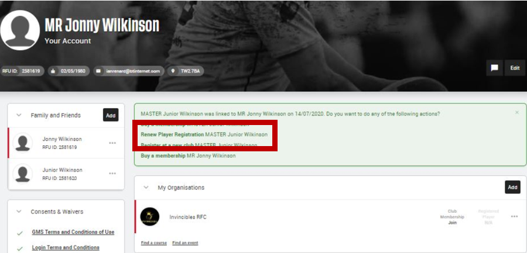

# RENEW AGE GRADE CHILD AFFILIATION (REGISTRATION) PROCESS

Player registration is an RFU requirement for any player to play for a rugby club and is separate from membership of a club. This example is to show a parent/guardian how to renew a player registration **(now called affiliation)** for an existing child (Age Grade player) who is already linked to Norwich RFC.

Login to the GMS through this link https://gms.rfu.com/GMS/Account/Login

If you require your username, please contact one of us:

## Club Membership Secretary

 * Vicky Regester
 * vickyregester@gmail.com
 * Mob: 07804 228005

## Minis

 * Emma Allen
 * emma.allen@aviva.com
 * Mob: 07787 115682

If you do not know your password, click on Forgot password and an email will be automatically sent to you **(this may appear in your spam folder and the sender will be FirstSports)**.

Once you have logged into GMS, on your Personal Profile under the Green Dashboard Notifications, you simply click on the `Renew Player Registration` link to complete.

Or you can click on your child’s profile under Family and Friends and then click on the link for `Renew Player Affiliation`.

**If your child is not linked to your account – please contact one of the membership team, who will link your accounts so you can then complete this process.**

This will take you through to the Player Registration Form which will be mostly pre-populated as this is a registration renewal. Simply check all the details are still correct, fill out any missing details, tick the relevant consents/waivers and click `SAVE`. You can edit or fill in any incorrect details by clicking on the pencil, or `…` icons and `+` to add.

The parent/guardian will then receive an automated email confirming completion of Renewal of the Age Grade Registration, and this will now show as Active Status under the Registered Player of the club on the child's profile under My Organisations, and this Player Registration is now complete.

### NOTE: Please DO NOT click the “affiliate” button for parents/guardians/non-playing members as this is for players only.
